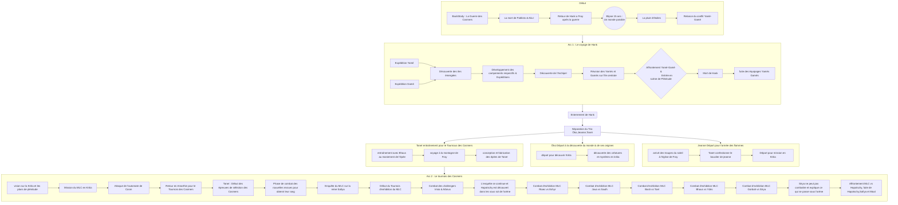

#timeline

```mermaid
  graph TD 
	  subgraph s1[Début]
		  id1[BackStody : La Guerre des Cosmers] 
		  --> id2[La mort de Paléisto & Alix.I]
		  --> id3[Retour de Hank a Fray après la guerre]
		  --> id4((Elipse 15 ans :
		  Un monde paisible))
		  --> id5[La pluie d'étoiles]
		  --> id6[Relance du conflit Yamé-Gamé]
	  end
	  
	  subgraph s2[Arc 1 : Le voyage de Hank]
		  id7[Expédition Yamé]-->id9[Découverte des ïles émergées]
		  id8[Expédition Gamé] -->id9[Découverte des ïles émergées]-->
		  id10[Développement des campements respectifs & Expéditions]-->
		  id11[Découverte de l'Archipel]-->
		  id12[Réunion des Yamés et Gamés sur l'île centrale]-->
		  id13{Affrontement Yamé-Gamé &
		  Entrée en scène de Plénitude}-->
		  id14[Mort de Hank]-->
		  id15[fuite des équipages Yamés Gamés]
	  end 


	  subgraph s3[Enterrement de Hank]
	  
	  end


	  subgraph s4[Séparation du Trio Öko,Jeanne,Taneï]
	  
	  end


	  subgraph s5[Jeanne Départ pour l'armée des flammes]
		  id20[arrivé des troupes du soleil à l'église de Fray]
		  --> id21[Taneï confectionne le bouclier de jeanne]
		  --> id22[Départ pour mission en Kritia]
	  
	  end


	  subgraph s6[Öko Départ à la découverte du monde & de ses origines]
		  id23[départ pour découvrir Kritia]
		  --> id24[découverte des créatures et mystères en kritia]
	  end


      subgraph s7[Taneï entraînement pour le Tournous des Cosmers]
	      id25[entraînement avec Bhaus au maniement de l'épée]
		  --> id26[voyage à la montagne de Fray]
		  --> id27[conception et fabrication des épées de Taneï]
      end


	 subgraph s8[Arc 2 : Le tournois des Cosmers]
		 id28[vision sur la Kritia et les plans de plénitude]
		 --> id29[Mission du MLC en Kritia]
		 --> id30[Attaque de l'automate de Cosm]
		 --> id31[Retour en Amarthie pour le Tournois des Cosmers]
		 --> id32[Taneï : Début des épreuves de séléction des Cosmers]
		 --> id33[Phase de combat des nouvelles recrues pour obtenir leur rang]
		 --> id34[Enquête du MLC sur la reine Safiya]
		 --> id35[Début du Tournois d'exhibition du MLC]
		 --> id36[Combat des challengers Irisio & Aïbnus]
		 --> id37[L'enquête se continue et Hapotschy est découvert dans les sous sol de l'arène]
		 --> id38[Combat d'exhibition MLC Riaec vs Eshyr]
		 --> id39[Combat d'exhibition MLC Java vs Saulh]
		 --> id40[Combat d'exhibition MLC Bash vs Toel]
		 --> id41[Combat d'exhibition MLC Bhaus vs Ydris]
		 --> id42[Combat d'exhibition MLC Gorbah vs Strya]
		 --> id43[Strya ne peut pas combattre et explique ce qui se passe sous l'arène]
		 --> id44[Affrontement MLC vs Hapotschy, fuite de Hapotschy,Safiya et Moal]
	  end 
	  
	
	  
 
 
 s1-->s2-->s3-->s4
 s4-->s5
 s4-->s6
 s4-->s7-->s8

```

