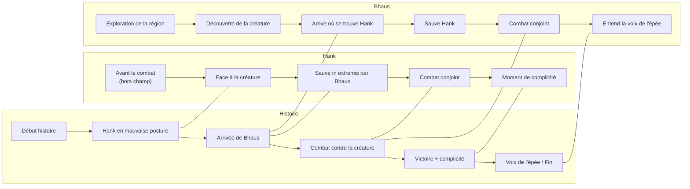

Link : [[BackStory - Tella & Bhaus]]

**De quoi ça parle** : [[Hank]] et [[Bhaus]], Alors deux figures montantes de l'ordre des Cosmers se mettent en quête de vaincre une créature altéré qui a décimé un nombre grandissant d'aventuriers et Cosmers.

L'ordre des Cosmers a annoncé qu'une large récompense d'or mais surtout de prestige serait attribué au Cosmer qui déferait la créature, le seul bémol ai que cette créature se renforce après chaque ennemis vaincus. S'étant renforcée petit à petit sur les premiers aventurier, elle est parvenu à tuer des grands nom de l'ordre chevalier. Aujourd'hui même des hordes de Cosmer entrainés ne réussissent plus à la blesser, faisant de cette créature la plus puissante que l'ordre n'est jamais eu a affronter.

En quête de Gloire Hank se lance alors dans ce défi galvanisé par ses précédentes missions réussies. Évidement sont rivale de toujours Bhaus décide au même moment de lui aussi affronter la créature.

Hank arrive le premier en [[L'Aldisil]] et découvre cette araignée millénaire dans son entre remplie de cadavre d'Elfs et de Cosmers.

Après avoir incendié l'antre de la créature, sûr de son avantage Bhaus se lança au combat.
la créature ne se fit pas attendre et le combat commença.

Rapidement Hank fu totalement dépassé par la palette de compétence de la créature.
C'est à ce moment que Bhaus entre en scène, ayant quant à lui passer plus de temps à étudier l'histoire de cette araignée bien connue des habitants de cette régions d'Aldisil.

Cette espèce avait eu l'habitude de se nourrir du Cosm environnant depuis des années, mais cette araignée la était millénaire, au cours de sa vie elle avait absorbée tellement de Cosm qu'elle s'en était vu altérée. Désormais la créature s'en prenait aux Elfs des Bois qui était passés sur son chemin. C'est précisément à ce moment que les jeunes Cosmer en quête de gloire s'étaient précipités pour l'affronter, résultant en une hécatombe de décès dans les jeunes recrues. 

Lorsqu'il arrive sur place, Bhaus découvre qu'un combat est déjà engagé. Hank se trouve dans une position très fâcheuse.
Dans un premier temps les deux hommes se raillent comptant bien défaire la créature seul, mais rapidement Hank commençant a être à bout de force laisse Bhaus s'introduire dans le combat.
Les deux hommes continuent alors de combattre mais sans réelle synergie.

Il aura alors fallu que l'énergie des deux Cosmer soient très faible pour qu'ils finissent a abaisser leur égo et s'allier.

S'en suit un impressionnant combat ou ils se sauvèrent la vie de multiple fois.
Dans un final déchaîné, alors qu'ils sont à bout de force ils finirent par achever la créature en même temps.

La récompense et la gloire se verrait donc divisée en deux, et cet exploit n'a alors pas permis de départager les deux héros.

pour remercier Bhaus, Hank récupéra les restes de la créature ainsi que son sang noir et forgea une épée pour son rival.

Hank ne le su jamais mais l'âme de la créature qui avait déjà vécu plus de 1000 ans continuait de vivre à travers cette épée. Bhaus remarqua vite que cette dernière lui susurrait des paroles lorsqu'il la tient.

---------------------------------------

Concepts à introduire :
- [[Le Cosm]]
- [[Cosmer]]
- [[Faction Yamé]]

---

## Organisation du récit

## 1. Introduction : Hank en mauvaise posture

- La nouvelle s’ouvre sur **Hank**, en très mauvaise posture face à la créature.
    
- Il s’apprête à recevoir un **coup potentiellement fatal**.
    
- Dans un bref retour introspectif, il **résume comment il en est arrivé là**.
    

## 2. Flashback : Point de vue de Bhaus

- Quelques **semaines auparavant**, Bhaus explore la région.
    
- Il **découvre progressivement** l’histoire et la nature de la créature.
    
- La **timeline rejoint** celle du début, au moment où **Bhaus intervient** et aperçoit Hank en danger.
    

## 3. Intervention décisive : Bhaus sauve Hank

- **Bhaus entre en scène** et sauve Hank **in extremis**.
    
- Action tendue et dramatique marquant la **rencontre des deux protagonistes**.
    

## 4. Combat conjoint : Deux rivaux unis

- Le **point de vue devient partagé** entre Hank et Bhaus.
    
- Les deux rivaux **s’allient pour combattre** la créature.
    
- Le combat se termine par **une victoire** suivie d’un **moment de complicité** entre eux.
    

## 5. Épilogue : La voix de l’épée

- **Bhaus entend la voix de l’épée**, suggérant un mystère plus profond.
    
- **Fin ouverte**, laissant présager la suite ou une révélation à venir.
---

---
Idées d'ouverture de L'histoire.

Draft 1 :

Hank, pourtant de nature robuste commençais à fatiguer. Il sentais sur sa tempe sa sueur se mélanger au sang de sa plaie ouverte. Ce picotement vif le sorti rapidement de son étourdissement, lui permettant d'esquiver un coup de mandibule de la créature qui se dressait face à lui. 

Dans la pénombre de la grotte cette gigantesque araignée avait un avantage certain sur Hank. Il s'en voulait amèrement de s'être jeté dans ce combat tête baissé.

*Quel con !*, pensa Hank en serrant les dents.

Il repensa ensuite aux évènements qui l'avaient mené dans ce pétrin.

D'abord il y avait eu sa promotion dans l'ordre des Cosmers. Cette nouvel l'avait galvanisé, il faisait désormais parti de l'élite de l'ordre chevalier. Mais évidement ce n'était pas tout, son rival de toujours, lui aussi avait été promu. Encore une fois rien n'avait pas permis de les départager.

Ensuite il y avait eu la publication des nouvelles missions. ces dernières, classées de rang de F pour les plus faciles à SSS pour les missions d'élite étaient re-publiées chaque semaine. Pour assoir son nouveau statut Hank avait choisit une mission stratégique pour se faire bien voir.
En Aldisil, une région contrôlée par les Elfs de la faction Gamé*, une ancienne créature devenue aggressive s'en était prise à la population. L'ordre avait successivement rehausser le niveau de la mission de C à S car les Cosmers missionés ne revenaient pas.

